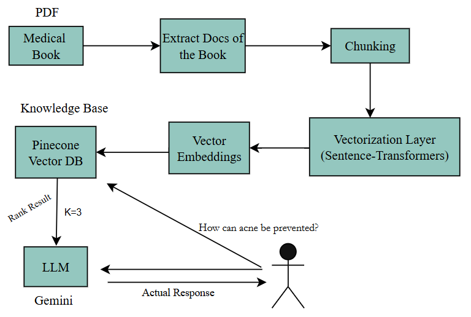

# Medical-Chatbot 
RAG-powered medical chatbot providing evidence-based insights on disease causes and treatments.


# 📊 Project Workflow




# 🛠️ Installation & Setup
### Steps: 

Clone the repository 

```bash 
git clone https://github.com/yyigitturan/Medical-Chatbot.git
```

### Step 01- Create a environment after opening the repository 

```bash 
python -m venv medicalbot
source medicalbot/bin/activate  
``` 
### Step 02- Install Dependencies

```bash 
pip install -r requirements.txt
``` 
### Step 03- Environment Configuration

Create a .env file with your API keys: 

```bash 
PINECONE_API_KEY=your_pinecone_api_key
GEMINI_API_KEY=your_gemini_api_key
``` 

### Step 04- Initialize Vector Database

```bash 
python store_index.py
``` 
### Step 05- Run the Application

```bash 
python app.py
``` 
### Docker Deployment
Build the Image

```bash 
docker build -t medical-chatbot .
``` 

Run the Container

```bash 
docker run -p 5000:5000 --env-file .env medical-chatbot
``` 
# 💡 Usage
Start the application

Access the web interface at http://localhost:5000

Enter medical questions like:

"How can acne be prevented?"


